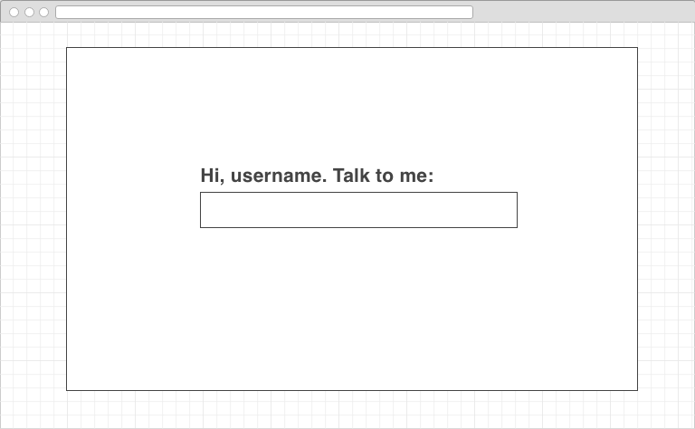

# Attitude Adjustment

## Synopsis

Insired by the Momentum Chrome extension and meditation mobile app, Headspace, Attitude Adjustment seeks to provide users with an interactive daily exchange to check in with mental/emotional status. A user is prompted to input a thought, the app will then provide content analysis (using IBM Watson's API) and provide 'adjustment' feedback throughout the day. 

User Story: a user wakes up, types the first thought that comes to mind: 'I'm feeling tired'. The app analysis would provide feedback: 'Hey, you sound negative, here's something to think about: '. The app would then generate 

## App Functionality Requirements

Login/Signup for user account. 
Input form to collect a phrase from a user. 
Post input to Watson Tone Analyzer API.
Grab output from Watson API and render analytics for user.
Based on analytics, send quote or exercise (stored in database) back to user.

## App Add On Ideas

In addition to a quote or exercise, provide user with mood over time analytics to see patterns.

## Motivation

As a new developer, I'm really interested in the ways people interface with technology in small, day to day interactions. How can an app change your day? 

## Installation

I intend to build the app using: 
Backend: Node/Express 
Frontend: React

## API Reference

Watson Tone Analyzer

## Hurdles

One of the biggest challenges was getting the correct user history to appear. I used 'date' instead of timestamp to bring back data from the DB. This didn't prove to be very accurate.

Also, I underestimated the amount of time it would take to make video animations. The intention was to have several videos categorized by mood. At this point, I only have 3 videos ready. 

## Moving Forward

I need to seed my database with more quotes. I want to make a library of daily challenge materials.

